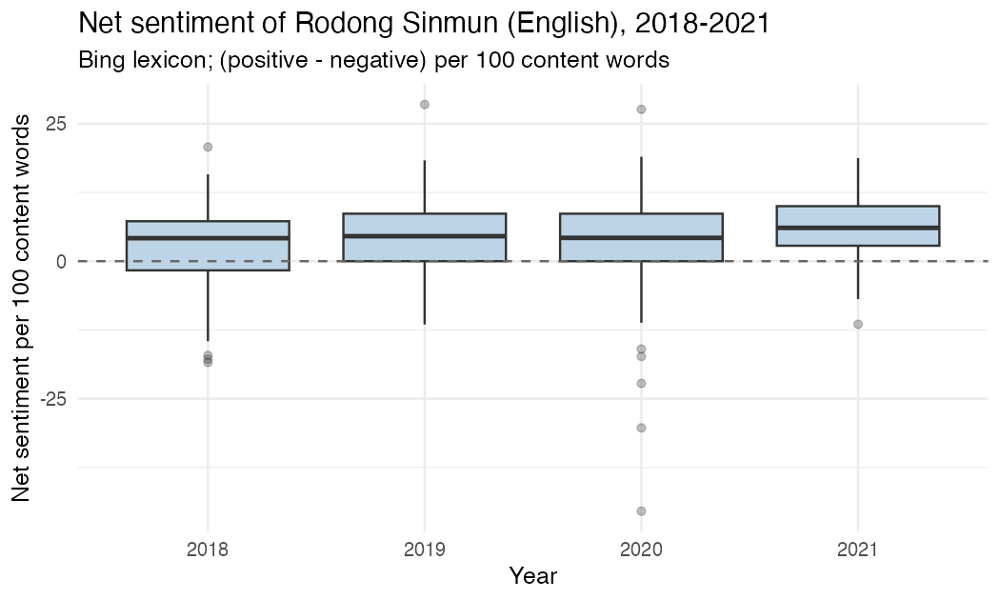
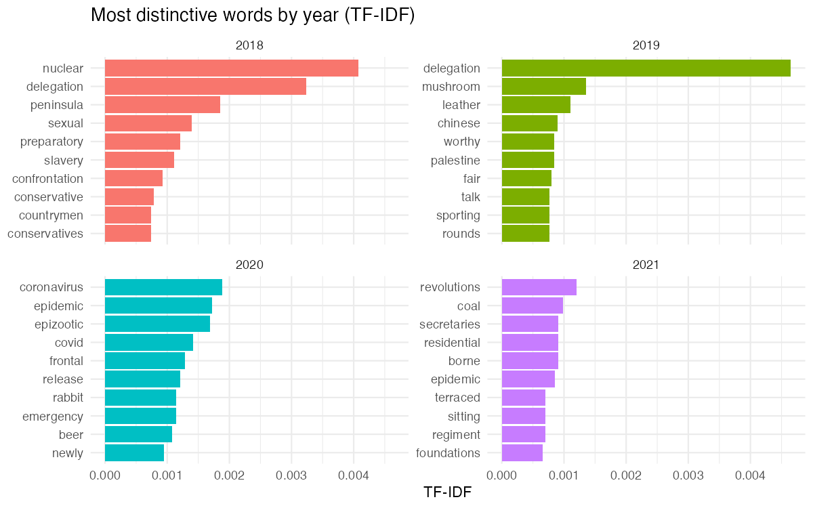

> **Note — not part of the paper.** This is a condensed model (~1,300 words) written to show the required section structure, the level of methods detail, inline figures, and citation practice. **Your paper must be 2,500–6,000 words** — expand the literature review and findings, not the framing. It deliberately uses a corpus and methods most of you will not use, so copy the *form*, not the content.

# Talking Past the Table: Sentiment and Topic in the English-Language *Rodong Sinmun*, 2018–2021^[Replication repository (data, code, figures): `https://github.com/example-student/rodong-sentiment-2018-2021`]

*Example Student · BA2 Digital Korea · Final Paper · June 2026*

## Research question

North Korea entered 2018 in an unprecedented burst of summit diplomacy — the inter-Korean meetings at Panmunjom and Pyongyang and the Singapore summit with the United States — and left the period, after the collapse of the Hanoi summit in February 2019 and the pandemic border closure of 2020, more isolated than it had been in a decade. The *Rodong Sinmun*, daily organ of the Workers' Party, publishes an English-language edition aimed at foreign readers. This paper asks: **did the affective tone of that edition track the diplomatic cycle — warming in the summit year and souring as diplomacy failed — or did it hold a stable register regardless of events?** An informative answer is one of two shapes: sentiment that rises and falls with diplomatic fortunes, or sentiment that is flat or even decoupled, which would suggest the paper's tone is governed by genre convention rather than circumstance. I expected the first and found the second.

## Brief literature review

Scholars of North Korean propaganda have long argued that its register is governed less by events than by a fixed ideological self-image. Myers (2010) describes an apparatus that presents the nation as pure and triumphant almost without regard to material circumstance — an account that predicts tonal stability rather than event-responsiveness. Smith (2015) likewise cautions against reading official North Korean output as a transparent index of policy. On method, dictionary-based sentiment analysis is a standard but blunt instrument: Grimmer, Roberts and Stewart (2022) note that lexicon methods measure aggregate affect cheaply but miss negation, irony and context, and are best read as relative comparisons across documents rather than absolute scores. Silge and Robinson (2017) give the tidy-text implementation of both the sentiment-lexicon and TF-IDF approaches used here. Together these works frame a testable expectation: if Myers is right, tone should stay flat across a period of sharp diplomatic change.

## Data and methods

The corpus is the `rodong_sinmun_en` dataset from the course menu: 600 English-language *Rodong Sinmun* articles dated between January 2018 and December 2021, spread across the four years (roughly 172, 149, 140 and 111 articles enter the analysis after preprocessing). I treat the `year` column as the comparison axis. Two preprocessing decisions narrow the data: I analyse the cleaned `text` field as provided (truncated upstream to 3,500 characters), and I drop three corpus-specific tokens — *sinmun*, *rodong*, *kcna* — that surface as masthead or wire-service artefacts rather than content.

I apply two methods. First, **dictionary sentiment** using the Bing lexicon, which labels English words positive or negative. For each article I count positive and negative words after removing English stop words and non-alphabetic tokens, then take a net score, `(positive - negative)`, normalised per 100 content words so that long articles do not dominate. I summarise the distribution of this article-level score by year (Figure 1). Because dictionary methods are blunt (Grimmer et al. 2022), I read the result as a relative comparison across years, not as an absolute measure of "positivity." Second, to see *what* each year is about rather than how it feels, I compute **term frequency–inverse document frequency (TF-IDF)** with the year as the document unit, which surfaces the words most distinctive to each year (Figure 2). The full pipeline — tokenisation, stop-word removal, both methods, both figures — is in `analysis/analysis.R` and regenerates from one command. (Had the corpus been Korean, the one addition would be morphological tokenisation with Kiwi, run through Orange's Python Script widget, before the bag-of-words step.)

## Analysis and findings

{ width=82% }

Figure 1 shows the distribution of article-level net sentiment for each year, and two things stand out. First, the median is **positive in every year**: the English-language *Rodong Sinmun* reads as net-positive throughout, even in 2020, the year of border closure and pandemic emergency. Second, sentiment does **not** fall as diplomacy collapses. If anything it rises — median net sentiment climbs from about 4.2 per 100 words in 2018 to 6.1 in 2021, and the 2021 distribution sits visibly higher and tighter than the others (mean 6.3 versus 2.8 in 2018). The summit year is, counterintuitively, the *least* positive of the four. The long lower whisker and the strongly negative outliers in 2020 are a handful of articles on the pandemic and on "hostile forces"; they pull the 2020 mean down relative to its median but do not move the typical article, which is as positive as a typical 2018 one.

{ width=92% }

Figure 2 explains what sits behind the stable tone: the *topic* shifts sharply even as the register does not. 2018 is dominated by the language of nuclear diplomacy — *nuclear*, *delegation*, *peninsula*, *confrontation*. 2020 is dominated by the pandemic — *coronavirus*, *epidemic*, *epizootic*, *covid*, *emergency*. 2021 turns inward to economic construction and the Eighth Party Congress — *revolutions*, *coal*, *secretaries*, *residential*. The paper is plainly writing about different things from year to year; what it is *not* doing is changing its affective register to match.

Read together, the figures support the second answer posed at the outset. The English-language *Rodong Sinmun*'s tone is decoupled from North Korea's diplomatic fortunes: subject matter tracks events closely — diplomacy, then pandemic, then domestic economy — but the positive register is a constant, strongest in the most isolated year. This is consistent with Myers's (2010) account of a propaganda voice governed by a fixed self-image rather than by circumstance. A caveat follows from the method: Bing scoring counts words like *victory*, *great* and *successful* as positive regardless of context, and North Korean prose uses such words as fixed epithets. The rising 2021 score may reflect denser ritual epithet rather than warmer content — which is itself the point, that the register is formulaic. Separating the two would need a context-aware method, so the comparison is offered as relative, as the lexicon literature advises.

## Summary and conclusion

The English-language *Rodong Sinmun* held a stable, positive affective register across 2018–2021 while its topical content moved with events, and its tone was *highest* in 2021, the most diplomatically isolated year in the window. Tone and circumstance are decoupled. The main limitation is the bluntness of dictionary sentiment on a corpus saturated with formulaic positive epithets; a follow-up could compare the Bing result against a context-aware classifier, or test whether the same decoupling holds in the Korean-language edition, which addresses a domestic rather than foreign audience. What surprised me was the direction of the trend: I expected the summit year to be the most upbeat and found it the least.

## References

Grimmer, J., Roberts, M. E., & Stewart, B. M. (2022). *Text as Data: A New Framework for Machine Learning and the Social Sciences*. Princeton University Press.

Myers, B. R. (2010). *The Cleanest Race: How North Koreans See Themselves and Why It Matters*. Melville House.

Silge, J., & Robinson, D. (2017). *Text Mining with R: A Tidy Approach*. O'Reilly Media.

Smith, H. (2015). *North Korea: Markets and Military Rule*. Cambridge University Press.
